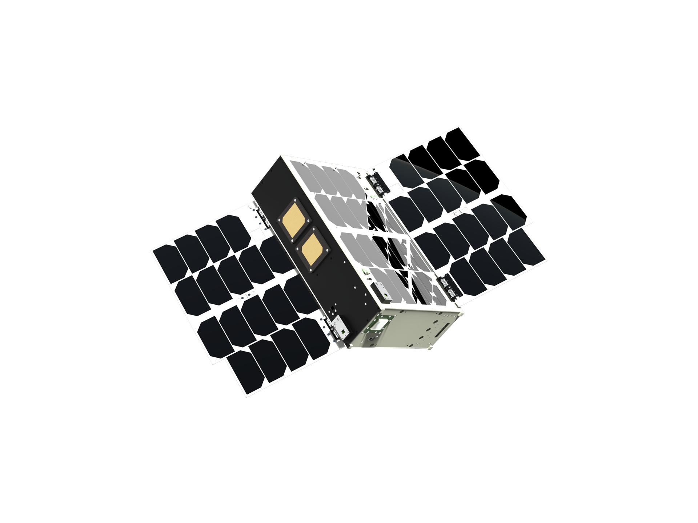

.. .....................................................................

.. MODULE SPECIFIC STATICS..............................................

.. |description| replace:: C-Shell

.. .....................................................................

.. DOCUMENT CONTENT ..............................................

CSH
===========================================================================

Command Shell for Linux PC's

Description
--------------------
.. include:: MAN/Introduction/description.rst

Features
--------------------
.. include:: MAN/Introduction/features.rst

Physical Setup
--------------------
.. include:: MAN/Introduction/physical_setup.rst

.. raw:: pdf

    PageBreak 

Installation
===========================================================================

Requirements
-------------------
.. include:: MAN/Installation/requirements.rst

Installation
------------------------
.. include:: MAN/Installation/install.rst

Manual build from sources
-------------------------
.. include:: MAN/Installation/build.rst

Launch software
--------------------
.. include:: MAN/Installation/launch_sw.rst

Initial configuration
------------------------
.. include:: MAN/Installation/init_config.rst

.. raw:: pdf

    PageBreak 

Operating instructions
===========================================================================
.. include:: MAN/Operating_Instructions/usage.rst

Shell interface
-------------------
.. include:: MAN/Operating_Instructions/shell_interface.rst

Example module testing procedure using CSH
--------------------------------------------
.. include:: MAN/Operating_Instructions/example.rst

.. raw:: pdf

    PageBreak oneColumn

Command examples
-----------------------------
.. include:: MAN/Operating_Instructions/command_examples.rst

Named Commands
~~~~~~~~~~~~~~~~~~~~~~~~~~~~~~~~~~~~~~~~~~~~~~~~~~~~~~~~~
.. include:: MAN/Operating_Instructions/scheduler_examples.rst

.. include:: MAN/Operating_Instructions/environment_variables.rst

.. raw:: pdf

    PageBreak 

APMs
===========================================================================
.. include:: MAN/APMs/introduction.rst

Commands provided by CSH SI
-----------------------------
.. include:: MAN/APMs/csh_si.rst

Creating a new APM
-----------------------------
.. include:: MAN/APMs/csh_example.rst

.. raw:: pdf

    PageBreak 

Appendices
===========================================================================

List of Built-in commands
-----------------------------

.. partool -q --csv -s builddir/csh > doc/MAN/Operating_Instructions/builtin_commands.csv

.. csv-table:: Built-in commands
    :file: MAN/Operating_Instructions/builtin_commands.csv
    :widths: 20 20 70
    :header-rows: 1
